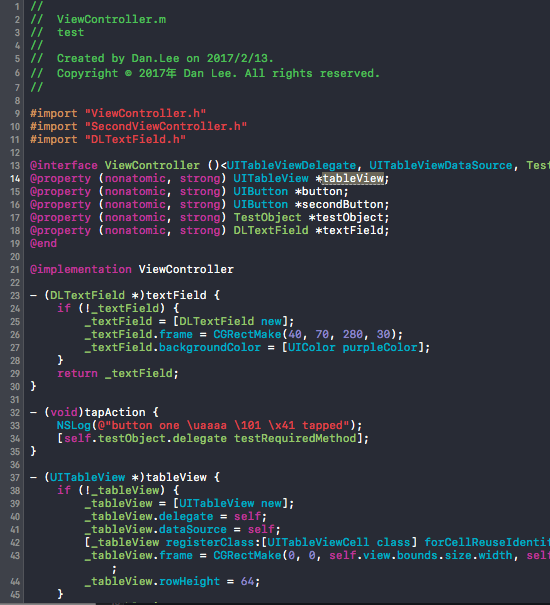

If you need English document [`CodeSecurity` English Document](https://github.com/danleechina/CodeSecurity/blob/master/README-en.md)

# CodeSecurity

Xcode 8+ 下面的 Object C 代码加密混淆插件。

# 特性

1. 加密混淆明文字符串
2. 加密混淆类名和方法名（同样的命令可以反混淆）
3. 加密混淆属性变量（同样的命令可以反混淆）
4. 解密已加密混淆的明文字符串

# 使用建议
 
 1. 推荐混淆实现文件（也就是扩展名为 m 或者 mm 的文件）的方法、属性名，不建议混淆头文件中暴露的方法、属性名。
 2. 每次混淆字符（方法、类名、属性名），除非你清楚混淆的原理，否则建议你最好编译运行一下相应代码，确保没有编译错误，也没有运行时出错
 3. 混淆头文件中的符号也是可以的，但是需要保证包含该头文件的相应代码文件不受影响
 4. 不能在子类中混淆父类的方法！！
 5. 如果你混淆明文字符串的话，建议配套使用我的另外一个 [mixplaintext](https://github.com/danleechina/mixplaintext/blob/master/MixIosDemo/MixOC/MixDecrypt.h) 中的 dl_getRealText 方法，以便能够在运行时解密。
 6. 混淆类名，需要在头文件中进行。如果在实现文件中混淆，那么头文件中定义的类无法找到。

## 使用要求

需要 Xcode 8.0+

## 安装

1. 在 OS X 10.11 El Capitan 上，运行下列命令并重启 Mac：
	`sudo /usr/libexec/xpccachectl`
2. 打开 `CodeSecurity.xcodeproj`
3. 修改 CodeSecurity 和 Obfuscation target 的代码签名为你自己的开发者账号
4. Product > Archive
5. 右键 archive > Show in Finder
6. 右键 archive > 显示包内容
7. 打开 Products, Applications
8. 将 CodeSecurity.app 拷贝到你的应用程序目录
9. 运行 CodeSecurity.app 并推出
10. 去到系统设置 > 扩展 > Xcode Source Editor 然后选择 Obfuscation 扩展
11. 在 Xcode 的 Editor 下面就能看到该扩展了
12. 你可以在 Xcode Preference 的 Key Bindings 选项中给这些命令设置快捷键，方便使用

## TODO

1. 支持 Swift
2. 混淆宏放在代码所有 import 的头文件之后，避免影响 import 的头文件中符号定义

## 贡献者

作者: [@粉碎音箱的音乐(weibo)](http://weibo.com/u/1172595722) 

Blog: [Blog](http://danleechina.github.io/)

## 需要 Star！

如果你觉得 `CodeSecurity` 有用的话，请点个 star 呗！谢谢啦。😄

